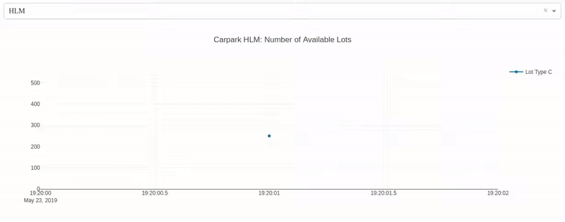

# Singapore Carpark Availability Real-time Dashboard



A simple real-time dashboard that tracks Singapore carpark lots availability that is built on Python using primarily dash and plotly.

[Link to SG OpenData Carpark Availability API documentation](https://data.gov.sg/dataset/carpark-availability)

## Getting Started

Clone the github repo onto your local machine

```
git clone https://github.com/limjiaxiang/dashes-with-dash.git
```

### Prerequisites

* Python 3.6.8
* Browser, preferably Google Chrome

### Installing

E.g. With Anaconda

Create a separate environment
```
conda create -n yourenvname python=3.6 anaconda
```

Activate environment
```
source activate yourenvname
```

**Change current working directory on terminal to cloned repository directory where requirements.txt reside in**

Install required libraries to newly created environment
```
pip install -r requirements.txt
```

You're done with setting up the Python environment!

## Running the dashboard

1. Change current working directory of the terminal to sg-carparks sub-directory of the repository

2. Execute the python file from the terminal
```
python carpark-dash.py
```

3. Open your browser of choice and visit localhost with the port stated
> localhost:8050

4. Explore the dashboard
Be patient! Data points are collected in 1 minute intervals

## Authors

* **Lim Jia Xiang** - *Initial work* - [limjiaxiang](https://github.com/limjiaxiang)

## License

This project is licensed under the Apache License 2.0 - see the [LICENSE.md](LICENSE.md) file for details

## Acknowledgments

* Dash/Plotly forums

